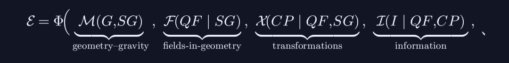

# Chartreuse Unification Model

<p align="center">
  
</p>

<p align="center">
  <strong>A Theoretical Framework for Unifying Fundamental Physics</strong>
</p>

<p align="center">
  <em>By Jose Angel Solorzano Luna</em>
</p>

---

## Overview

The **Chartreuse Unification Model** is a theoretical physics framework that synthesizes concepts from string theory, supersymmetry, and supergravity into a coherent approach toward understanding the fundamental nature of spacetime and matter.

This research weaves together:
- **10-dimensional effective actions**
- **Supersymmetry (SUSY)**
- **Kähler geometry**
- **Superpotentials**
- **Gravitational corrections**

These concepts emerge from legitimate research areas in high-energy theoretical physics—efforts to unify gravity with quantum fields that have inspired serious work toward a "theory of everything."

---

## Core Concepts

### 1. 10-Dimensional Effective Actions

The model operates within a 10-dimensional spacetime framework, consistent with superstring theory. Six of these dimensions are compactified on Calabi-Yau manifolds, yielding effective 4-dimensional physics observable at low energies.

```
S₁₀ = (1/2κ₁₀²) ∫ d¹⁰x √-g e^{-2φ} [R + 4(∂φ)² - (1/12)H²]
```

### 2. Supersymmetry

Supersymmetry provides a symmetry between fermions and bosons, offering natural solutions to hierarchy problems in particle physics and predicting superpartner particles.

```
{Qₐ, Q̄_{β̇}} = 2σ^μ_{αβ̇} P_μ
```

### 3. Kähler Geometry

The internal geometry of compactified dimensions is described by Kähler manifolds. The Kähler metric derives from a Kähler potential K:

```
g_{ij̄} = ∂_i ∂_{j̄} K(z, z̄)
```

### 4. Superpotentials

Holomorphic functions W(Φ) encode the interactions of chiral superfields and determine the scalar potential:

```
V = e^{K/M²_P} [K^{ij̄} D_i W D̄_{j̄} W̄ - 3|W|²/M²_P]
```

### 5. Gravitational Corrections

Higher-order curvature terms and quantum corrections modify Einstein gravity at Planck-scale energies:

```
S = ∫ d⁴x √-g (R + αR² + βR_{μν}R^{μν} + ...)
```

---

## Research Areas

### String Theory & Compactification
Investigating how extra dimensions can be compactified to yield realistic 4D physics, including moduli stabilization and flux compactifications.

### Supersymmetry Breaking
Exploring mechanisms by which supersymmetry is broken at low energies while preserving its benefits for solving theoretical problems.

### Quantum Gravity
Studying how quantum effects modify gravitational physics at the Planck scale and potential resolutions to spacetime singularities.

### Grand Unification
Examining how the Standard Model gauge groups may unify at high energies within a supersymmetric framework.

---

## Mathematical Framework

The Chartreuse Unification Model employs advanced mathematical structures:

| Structure | Application |
|-----------|-------------|
| Calabi-Yau Manifolds | Compactification of extra dimensions |
| Kähler Geometry | Internal space metric structure |
| Superspace | Supersymmetric field theory formulation |
| Moduli Spaces | Vacuum structure and deformations |
| Holomorphic Functions | Superpotential and gauge kinetic functions |

---

## Key Equations

### The N=1 Supergravity Scalar Potential
```
V = e^{K/M²_P} [K^{ij̄} D_i W D̄_{j̄} W̄ - 3|W|²/M²_P] + (1/2)(Re f)^{-1}_{ab} D^a D^b
```

### Kähler Covariant Derivative
```
D_i W = ∂_i W + (∂_i K / M²_P) W
```

### Supersymmetry Transformation
```
δψ_μ = D_μ ε + (i/2) e^{K/2M²_P} W γ_μ ε*
```

---

## References & Foundations

This work builds upon foundational contributions in:

1. **String Theory**: Green, Schwarz, Witten - *Superstring Theory* (1987)
2. **Supergravity**: Freedman, Van Proeyen - *Supergravity* (2012)
3. **Kähler Geometry**: Candelas, Horowitz, Strominger, Witten - *Vacuum Configurations for Superstrings* (1985)
4. **Moduli Stabilization**: Kachru, Kallosh, Linde, Trivedi - *KKLT* (2003)

---

## About the Author

**Jose Angel Solorzano Luna** is a theoretical physics researcher focused on the synthesis of advanced concepts from string theory, supersymmetry, and supergravity. The Chartreuse Unification Model represents years of deep study and creative synthesis in pursuit of understanding the fundamental nature of reality.

---

## Contact

- **Website**: [jasl-physics.manus.space](https://jasl-physics.manus.space)
- **Email**: contact@jasl-physics.com
- **GitHub**: [@col8jose](https://github.com/col8jose)

---

## License

This theoretical framework and associated documentation are shared for educational and research purposes.

---

<p align="center">
  <em>"The universe is written in the language of mathematics."</em> — Galileo Galilei
</p>
